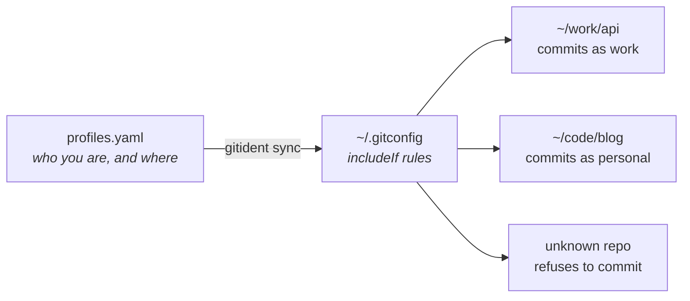

# gitident

[](https://github.com/leoru/gitident-cli/actions/workflows/ci.yml)
[](https://github.com/leoru/gitident-cli/actions/workflows/ci.yml)
[](https://github.com/leoru/gitident-cli/releases/latest)
[](go.mod)
[](LICENSE)

**Commit with the right git identity everywhere, automatically.**

Work email in `~/work`, personal email in `~/code`, a different signing key for
that one client repo: you describe it once in a small YAML file, and git picks
the right name, email, signing key and SSH key in every repository.

No more `git config user.email` in each new clone, and no more commits pushed
under the wrong email.

## How it works



1. You list your **profiles** (name, email, keys) and **rules** that say where
   each one applies, by folder or by remote URL.
2. `gitident sync` turns that into plain git config. Nothing runs in the
   background.
3. git applies the right profile on its own, so your terminal, IDE and GitKraken
   all get it right.

## Install

```sh
brew install leoru/tap/gitident
```

Alternatively, run `go install github.com/leoru/gitident-cli/cmd/gitident@latest`,
download a release from the [releases page](https://github.com/leoru/gitident-cli/releases),
or run `make install` from a checkout.

## Get started

### 1. Create your config

```sh
gitident init
```

This writes `~/.config/gitident/profiles.yaml`. Edit it to look something like this:

```yaml
version: 1

profiles:
  personal:
    name: Kirill Kunst
    email: kirill@example.org
  work:
    name: Kirill Kunst
    email: kirill@company.com
    signing_key: ~/.ssh/id_work.pub   # optional
    gpg_format: ssh                   # optional
    gpgsign: true                     # optional
    ssh_key: ~/.ssh/id_work           # optional: push/pull with this key

rules:
  - profile: personal
    dirs: ["~/code"]                  # every repo in ~/code
  - profile: work
    dirs: ["~/work"]                  # every repo in ~/work…
    remotes: ["git@github.com:company/**"]   # …and every company repo, wherever it is
```

### 2. Apply it

```sh
gitident sync --dry-run   # preview
gitident sync             # apply
```

### 3. Check it

```sh
gitident which            # the identity git uses right here, and why
gitident check            # scans all your repos and reports any problem
```

Already set up identities by hand, or in GitKraken? Run `gitident import` instead
of `init`. It reads your current setup and writes the YAML for you. See the
[migration guide](docs/guide.md#migrating-an-existing-setup).

## Everyday use

| I want to… | Run |
| --- | --- |
| See which identity a repo uses | `gitident which` |
| Use a different profile for this one repo | `gitident use work` (add `--save` to remember it in the YAML) |
| Undo that | `gitident unuse` |
| Make a repo's identity work in a dev container or GUI client that ignores includeIf | `gitident apply` (or `materialize: true` in the YAML) |
| Check that a commit would work unattended (identity and signing) | `gitident preflight` |
| Stop AI agents (Claude Code, Codex, Cursor, Gemini, Copilot…) from committing with the wrong identity | `gitident agent install` |
| Apply changes after editing the YAML | `gitident sync` |
| Find repos with a wrong or missing identity | `gitident check` |
| Check that everything is set up correctly | `gitident doctor` |
| Remove gitident's changes from `~/.gitconfig` | `gitident uninstall` |

Every command also works as `git ident …`.

**When several rules match a repo**, the more specific one wins: later rules beat
earlier ones, a repo listed under a profile's `repos` beats any rule, and
`gitident use` beats everything. By default, a repo that matches nothing
**refuses to commit** instead of silently using the wrong email.

## Good to know

- gitident only changes a clearly marked block at the end of `~/.gitconfig`.
  Everything else in that file stays as you wrote it.
- Remote-URL rules need git 2.36 or newer. `gitident doctor` tells you whether
  your git supports them.
- Shell completion: `gitident completion bash|zsh|fish`. Homebrew sets it up
  automatically.

**Want the details?** The [guide](docs/guide.md) covers how it works internally,
the full config reference, every command, migrating an existing setup,
worktrees, submodules and other edge cases.

## License

MIT
