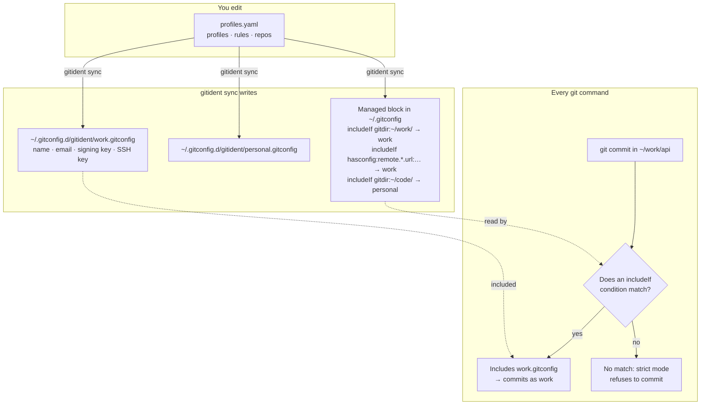
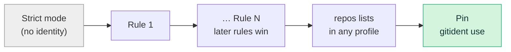
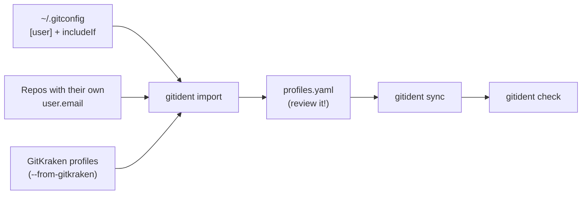

# gitident guide

This is the full reference. For a quick introduction, see the [README](../README.md).

- [How it works](#how-it-works)
- [Which profile wins](#which-profile-wins)
- [Copying profiles into repositories](#copying-profiles-into-repositories)
- [AI agents and scripts](#ai-agents-and-scripts)
- [Configuration reference](#configuration-reference)
- [Commands](#commands)
- [Migrating an existing setup](#migrating-an-existing-setup)
- [Keeping it honest](#keeping-it-honest)
- [FAQ](#faq)
- [Development and releases](#development-and-releases)

## How it works

gitident never runs in the background and doesn't wrap git. `gitident sync`
turns `profiles.yaml` into ordinary git config, and then git does the matching
on its own every time it runs.



`sync` writes two things:

1. **One fragment per profile** at `~/.gitconfig.d/gitident/<profile>.gitconfig`,
   containing `[user]`, `[commit] gpgsign`, `[gpg] format`, `[core] sshCommand`
   and your `extra` keys.
2. **A managed block** at the end of your global gitconfig (`$GIT_CONFIG_GLOBAL`,
   else `~/.gitconfig`, else `~/.config/git/config`). Everything outside the block
   is left byte-for-byte untouched. The file is written atomically, and if it is a
   symlink into a dotfiles repo, the target is updated in place.

   The block contains no `[user]` section of its own. Strict mode lives in
   `_strict.gitconfig` instead, so values you set with `git config --global user.…`
   always land outside the block. If you do put settings inside the block, `sync`
   stops and lists them rather than deleting them.

```gitconfig
# >>> gitident managed block — edit profiles.yaml and run `gitident sync` >>>
# strict_identity: user.useConfigOnly = true
[include]
	path = ~/.gitconfig.d/gitident/_strict.gitconfig
# rule 1 → personal
[includeIf "gitdir:~/code/"]
	path = ~/.gitconfig.d/gitident/personal.gitconfig
# rule 2 → work
[includeIf "gitdir:~/work/"]
	path = ~/.gitconfig.d/gitident/work.gitconfig
[includeIf "hasconfig:remote.*.url:git@github.com:company/**"]
	path = ~/.gitconfig.d/gitident/work.gitconfig
# repos → work
[includeIf "gitdir:~/misc/legacy-thing/.git"]
	path = ~/.gitconfig.d/gitident/work.gitconfig
[includeIf "hasconfig:remote.*.url:git@github.com:company/infra"]
	path = ~/.gitconfig.d/gitident/work.gitconfig
[includeIf "hasconfig:remote.*.url:git@github.com:company/infra.git"]
	path = ~/.gitconfig.d/gitident/work.gitconfig
# <<< gitident managed block <<<
```

Because the fragments are *included*, not copied, editing a profile and running
`sync` updates every repository at once.

## Which profile wins

For every setting, git keeps the **last** value it reads. gitident orders the
block so that reading order *is* the priority order:



*Lowest priority on the left, highest on the right.*

- **Rules** apply in file order, so a later rule overrides an earlier one. Within
  a rule, `dirs` come before `remotes`.
- **`repos`** entries beat all rules. A path matches exactly that repository
  (`gitdir:<path>/.git`; nested repos don't inherit it). A URL matches the remote
  with or without `.git`.
- **Pins** made with `gitident use` live in the repository's own `.git/config`.
  git reads that after the global config, so pins beat everything.
- **Strict mode** (`strict_identity: true`, the default) sets
  `user.useConfigOnly`, so git refuses to commit in a repository that matches
  nothing instead of guessing an identity from your hostname.

Remote globs follow git's own rules: `*` matches anything except `/`, and `**`
matches anything including `/` when it is a whole path component
(`git@github.com:company/**`).

## Copying profiles into repositories

The includeIf rules only work where git reads your global gitconfig and the
fragments it includes. Some places don't:

- **Dev containers and remote machines.** VS Code copies `~/.gitconfig` into the
  container, but not `~/.gitconfig.d/gitident/`, so the includes point nowhere.
- **Git clients built on libgit2**, which may not evaluate
  `includeIf "hasconfig:remote.*.url:…"`, so `remotes` rules and URL `repos`
  entries are invisible to them.

For these, gitident can copy a repository's profile straight into its own
`.git/config`, which travels with the repository:

```sh
gitident apply              # the current repository
gitident apply ~/work/api   # or any others
gitident apply --all        # every repository a profile applies to
```

The copy holds everything the fragment would: `user.name`, `user.email`, the
signing settings, `core.sshCommand` and `extra` keys. Which profile is copied
follows the usual [precedence](#which-profile-wins): the pin if there is one,
else rules and `repos` lists.

To have this happen automatically, turn on `materialize`. `sync` then copies
the profile into every matching repository it finds under the default roots,
including new clones:

```yaml
materialize: true          # every profile
profiles:
  work:
    materialize: true      # or per profile (overrides the top-level value)
```

Copies stay honest:

- gitident records what it wrote in a `[gitident]` section of `.git/config`
  (profile, keys and a hash of the values), and lists the repository in
  `~/.gitconfig.d/gitident/materialized.list`.
- `sync` rewrites every copy when you change `profiles.yaml`, switches it when
  a pin or rule change gives the repository another profile, and removes it
  when no profile applies any more. `use` and `unuse` update the copy at once.
- Values changed by hand since, and local settings gitident didn't write (a
  `user.email` you set yourself), are never overwritten. `sync` and `apply`
  report them; `--force` overwrites.
- `check` reports a copy that is out of date, changed by hand, or missing
  while `materialize` is on as `STALE`; `doctor` checks every copy too.
- `gitident unapply [dir…|--all]` removes copies, and `uninstall` removes them
  all. Turning `materialize` off keeps existing copies (and keeps them
  current) until you run `unapply`.

One trade-off: a copy only exists after `apply` or `sync` has run, so a fresh
clone relies on the includeIf rules until then (or fails in strict mode inside
a container). Run `gitident sync` after cloning when that matters.

## AI agents and scripts

Coding agents commit without anyone watching. When an identity is missing they
tend to "fix" it with `git config user.email …`, which quietly defeats strict
mode, and a signing key that needs a passphrase makes their commit hang on a
prompt nobody sees. gitident gives them three things.

### `gitident preflight`

One command that says whether a commit in a directory would go through with
the right identity, unattended:

```console
$ gitident preflight ~/Projects/wb/analytics
identity  kunst.kirill <kunst.kirill@wb.ru>  (profile wb)
FAIL signing_failed: commits here are signed (openpgp key A4A7100D728A87D5), but a test signature failed: gpg: signing failed: No pinentry
     → ask the user to unlock the GPG key in a terminal (…)
```

It checks that git has a `user.email`, that it belongs to a profile, and that
it is the profile the rules, `repos` lists or pin choose. It also flags an
identity no rule chose, such as a global `user.email`. When commits are signed,
it makes a test signature with the same program and key git would use, with
passphrase prompts disabled, so a locked key fails at once instead of hanging.

`--json` gives `ok`, the identity, the signing result and a list of `problems`,
each with a `code` and a `fix`. The exit status is 0 when a commit would go
through, 1 for an identity problem and 2 when only signing would fail.
`--no-sign` skips the signing test.

| Code | Meaning |
| --- | --- |
| `no_identity` | No `user.email`: no profile applies, or `sync` hasn't run. |
| `unknown_email` | The email isn't in any profile. |
| `unmatched` | The email belongs to a profile, but no rule, `repos` entry or pin chose it (e.g. a global `user.email`). |
| `mismatch` | A different profile than the rules say. |
| `stale_copy` | The profile copy in `.git/config` is out of date or was edited. |
| `signing_failed` | Commits are signed, but the test signature failed or would need a passphrase. |
| `not_a_repo`, `no_config` | Not in a repository, or `profiles.yaml` is missing or invalid. |

### Claude Code

```sh
gitident agent install            # ~/.claude (all projects); --scope project|local for one repo
```

This installs two things:

- **A PreToolUse hook** that looks at every shell command Claude is about to
  run. It blocks `git commit`, `merge`, `rebase`, `cherry-pick`, `revert`, `am`,
  `pull` and annotated tags when `preflight` finds a problem, and blocks
  setting the identity by hand (`git config user.email`, `git -c user.name=…`,
  `GIT_AUTHOR_*` variables). Claude sees the problem and its fix and can ask
  you. It understands `cd dir && git …` and `git -C dir …`. Commands made with
  `--no-gpg-sign` skip the signing test.
- **A `gitident` skill** telling Claude to run `preflight` before committing
  and how to handle each problem code.

`gitident agent status` shows what is installed; `gitident agent uninstall`
removes both and leaves the rest of your settings as they were. For other
agents, `gitident agent instructions` prints the same guidance for your
`AGENTS.md` or rule files.

### New clones

Agents often clone into fresh directories. With `clone_hook: true`, `sync`
installs a `post-checkout` hook in git's template directory, so every
`git clone` (and `git worktree add`) ends with one line such as:

```console
gitident: profile "work" (Kirill Kunst <kirill@company.com>), copied into .git/config
gitident: no profile applies to this repository, so commits will fail; run `gitident use <profile>` here (profiles: …)
```

With `materialize` on for the profile, the new clone also gets its copy right
away, before the first commit. If you already set `init.templateDir`, the hook
goes into that directory instead, and an existing `post-checkout` hook there is
never replaced (call `gitident __on-clone` from it yourself). A global
`core.hooksPath` stops git from running template hooks; `doctor` flags that.

## Configuration reference

The config lives at `$XDG_CONFIG_HOME/gitident/profiles.yaml`
(`~/.config/gitident/profiles.yaml`). Set `GITIDENT_CONFIG` to use a different file.

```yaml
version: 1                        # required
strict_identity: true             # user.useConfigOnly (default true)
materialize: false                # also copy profiles into each repo's .git/config
clone_hook: false                 # post-checkout hook in git's clone template

profiles:
  work:                           # letters, digits, . _ - (becomes a file name)
    name: Kirill Kunst            # required
    email: kirill@company.com     # required
    signing_key: ~/.ssh/id_work.pub   # GPG key id, or SSH key path / "key::…"
    gpg_format: ssh               # openpgp | ssh | x509
    gpgsign: true                 # commit.gpgsign
    ssh_key: ~/.ssh/id_work       # → core.sshCommand "ssh -i … -o IdentitiesOnly=yes"
    extra:                        # any other git setting, "section.key: value"
      pull.rebase: "true"
      url.git@github.com:.insteadOf: https://github.com/
    repos:                        # explicit repos; beat all rules
      - ~/misc/legacy-thing       # a path (absolute or ~/…)
      - git@github.com:company/infra.git   # or a remote URL
    materialize: true             # per-profile override of the top-level value

rules:                            # later rules override earlier ones
  - profile: work
    dirs: ["~/work"]              # every repo below these directories
    remotes:                      # every repo with a matching remote URL
      - git@github.com:company/**
      - https://gitlab.company.com/**

scan:
  ignore: ["archive", "~/work/tmp"]   # extra dirs `check` and `import` skip
```

`sync` refuses to run when the config has errors, such as missing name/email, an
unknown `gpg_format`, a rule pointing at an unknown profile, or the same repo
listed in two profiles. Warnings, such as a missing key file, are printed but
don't block `sync`.

## Commands

| Command | What it does |
| --- | --- |
| `gitident init [--force]` | Write a commented sample `profiles.yaml`, pre-filled with your current global name and email. |
| `gitident import [roots…] [--write\|--merge\|--force] [--from-gitkraken] [--interactive]` | Build `profiles.yaml` from your existing git setup. Prints to stdout unless `--write` is given. |
| `gitident sync [--dry-run] [--no-prune]` | Validate, write fragments, delete fragments of removed profiles, update the managed block, and bring profile copies in `.git/config` up to date. Running it twice changes nothing. |
| `gitident which [dir] [--json]` | Show the identity in a directory, where `user.email` comes from, which profile that is, and which profile is expected. |
| `gitident preflight [dir] [--json] [--no-sign]` | Check that a commit would go through with the right identity, and that signing works without a prompt. See [AI agents and scripts](#ai-agents-and-scripts). |
| `gitident check [roots…] [--json] [-q]` | Check every repository under the roots (default: all rule dirs plus the parents of listed repos). Exits 1 on problems. |
| `gitident use <profile> [dir] [--save]` | Pin a repository to a profile. `--save` also adds it to the profile's `repos` (keeping your YAML comments) and syncs. |
| `gitident unuse [dir]` | Remove the pin. Warns if a `repos` entry will keep applying. |
| `gitident apply [dir…\|--all] [--force] [--dry-run]` | Copy the repository's profile into its `.git/config`. See [Copying profiles into repositories](#copying-profiles-into-repositories). |
| `gitident unapply [dir…\|--all] [--force] [--dry-run]` | Remove copies made by `apply`. |
| `gitident agent install\|uninstall\|status [claude] [--scope user\|project\|local]` | Install the Claude Code hook and skill. `gitident agent instructions` prints guidance for other agents. |
| `gitident doctor` | Check the git version, config, key files, GPG/SSH signing setup, and whether the block and fragments are current. |
| `gitident uninstall [--dry-run]` | Remove the managed block, the fragments and the profile copies in repositories. Keeps `profiles.yaml`. |
| `gitident completion bash\|zsh\|fish` | Print shell completions. Profile names are completed for `use`. |
| `gitident version` | Print the version. |

Every command is also available as `git ident <command>`.

### `check` statuses

| Status | Meaning |
| --- | --- |
| `ok <profile>` | The identity matches `profiles.yaml`. The line adds `(copied into .git/config)` for copies made by `apply`, and `(set outside gitident: <file>)` when the identity comes from anywhere else, e.g. a `user.email` you set in `.git/config`. |
| `NO IDENTITY` | The repository has no `user.email`. In strict mode, commits fail here. |
| `UNKNOWN EMAIL` | The email isn't in any profile. |
| `MISMATCH` | The effective profile isn't what the rules, `repos` list or pin say. This is usually a leftover `user.email` in `.git/config`, or `sync` hasn't run yet. |
| `STALE` | The profile copy in `.git/config` (see `apply`) is out of date, was changed by hand, or is missing although `materialize` is on. |
| `MISSING` | A path in `repos` doesn't exist or isn't a repository. |
| `NOT CLONED` | A URL in `repos` has no clone under the scanned roots. Informational only. |

While scanning, a directory with a `.git` directory or file counts as a repository,
and the scan doesn't go inside it. The scan skips hidden directories,
`node_modules`, `.build`, `DerivedData`, `Pods`, `Carthage` and your
`scan.ignore` entries, and it doesn't follow symlinks.

### Shell completion

```sh
echo 'source <(gitident completion bash)' >> ~/.bashrc          # bash (also completes `git ident`)
gitident completion zsh > "${fpath[1]}/_gitident"                # zsh
gitident completion fish > ~/.config/fish/completions/gitident.fish
```

Homebrew installs these for you.

## Migrating an existing setup

`gitident import` reads the setup you already have and proposes a
`profiles.yaml`. It never touches your gitconfig; changing that is `sync`'s job.



- **Global config**: `[user]` plus every `includeIf "gitdir:…"` and
  `includeIf "hasconfig:remote.*.url:…"` fragment it references. import works out
  the identity each condition actually produces, in the order git reads them.
- **Repositories** under the roots you pass: identities set in their own
  `.git/config`. These become `repos` entries, unless the imported rules already
  give the repository that identity.
- **GitKraken** (`--from-gitkraken`): `~/.gitkraken/profiles/*/profile`. This is
  best effort. When a GitKraken profile has the same name and email as an
  identity found in git config, the two are merged.

Identical identities become one profile. A profile is named after its fragment
file (`~/.gitconfig-work` → `work`), its GitKraken profile name, or its email
domain (`kirill@welltory.com` → `welltory`). To choose the names yourself, pass
`--interactive`. Every profile gets a `# source:` comment.

To migrate:

```sh
gitident import ~/work ~/code --from-gitkraken          # 1. look at the proposal
gitident import ~/work ~/code --from-gitkraken --write  #    and save it
$EDITOR ~/.config/gitident/profiles.yaml                # 2. rename profiles, turn long repo
                                                        #    lists into `dirs` rules (import hints)
gitident sync --dry-run && gitident sync                # 3. apply
gitident check                                          # 4. fix until it's clean
```

When `check` is clean:

1. Delete the old `[user]` section and your hand-written `includeIf`s from
   `~/.gitconfig`. `sync` warns while a global `user.name` or `user.email` is left,
   because either one quietly defeats strict mode.
2. Clear the identity settings in GitKraken's profiles. GitKraken reads the
   effective git config anyway.

`import --merge` adds only new profiles, repos and rules to an existing
`profiles.yaml`, and keeps your comments.

## Keeping it honest

To catch drift automatically, run `check` on a schedule. For example, with cron:

```cron
0 9 * * 1  /opt/homebrew/bin/gitident check -q || osascript -e 'display notification "gitident check found problems" with title "gitident"'
```

## FAQ

**Does GitKraken (or my IDE) respect this?**
Yes. They run git, and git reads the config. After you migrate, clear the identity
fields in GitKraken's profiles so they don't override it.

**Worktrees?**
`dirs` rules match the worktree's git dir, which lives inside the main repository
(`main/.git/worktrees/<name>`). A worktree therefore follows the rules for the
main repository's location, not for the directory it's checked out in.
`gitident use` inside a worktree pins the whole repository, and `use --save`
records the main repository's path.

**Submodules?**
A submodule's git dir lives in the superproject (`.git/modules/<name>`), so the
submodule follows the superproject's `dirs` rules, and path entries can't match
it. List the submodule by its remote URL instead. `use --save` does that
automatically.

**macOS symlinked paths (`/var` → `/private/var`, or a symlinked `~/work`)?**
git resolves symlinks in the repository path but not in the pattern. So when a
`dirs` entry or `repos` path resolves to a different location, `sync` adds a
second `includeIf` for the resolved path.

**git older than 2.36?**
Older versions ignore `includeIf "hasconfig:remote.*.url:…"`, so `remotes` rules
and URL `repos` entries do nothing. `sync` and `doctor` warn about this. Everything
else still works.

**Why is `user.useConfigOnly` in the block?**
Without it, in a repository no rule matches, git invents an identity from your
username and hostname, and you only notice after pushing. To turn it off, set
`strict_identity: false`.

**Can I still edit `~/.gitconfig` by hand?**
Yes. Anything outside the markers is yours. If the markers are damaged, `sync`
won't touch the file and tells you how to fix it.

**How do I undo everything?**
Run `gitident unuse` in any pinned repositories, then run `gitident uninstall`.

## Development and releases

```sh
make test      # go test ./... (tests run real git in a throwaway $HOME)
make lint      # gofmt, go vet, staticcheck
make build     # bin/gitident (+ bin/git-ident symlink)
make snapshot  # local goreleaser dry run
```

To release, push a tag such as `v0.1.0`. The release workflow runs goreleaser,
which publishes the archives and updates the Homebrew cask in
`leoru/homebrew-tap`. It needs a `HOMEBREW_TAP_GITHUB_TOKEN` repository secret.

Out of scope: `gh`/`glab` credentials (that's a credential helper's job),
Windows, and a TUI.
